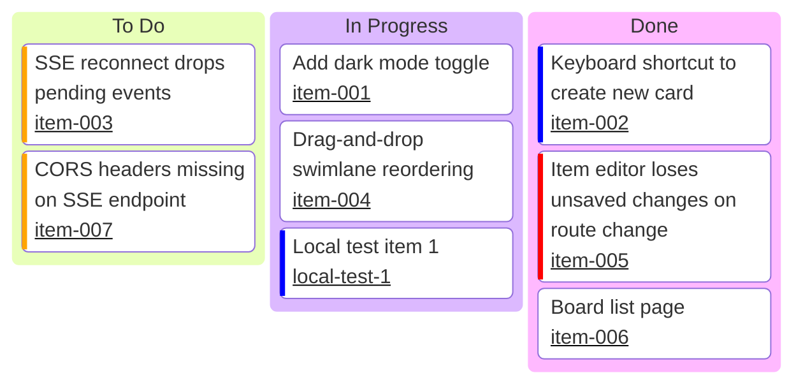

# awesome-markdown

Lightweight, git-backed kanban system. Pure client-side React UI with pluggable persistence providers and an independent sync-engine for git and external-change notifications.

## Overview

- **No central API.** The UI talks directly to whichever persistence provider is selected at runtime.
- **Two providers.** `provider-localstorage` runs entirely in-browser — zero server required. `provider-fs` is a local Fastify sidecar that stores kanban items as markdown files with YAML frontmatter.
- **Independent sync-engine.** A separate process watches `content/`, auto-commits, push/pulls a GitHub remote, and broadcasts SSE events to the UI.
- **Conflict-aware.** When a git pull cannot fast-forward, the sync-engine emits a `conflict` event and the UI shows a resolution dialog.

## Monorepo Layout

```
packages/
  contracts/            Zod v4 schemas + TypeScript types (shared)
  provider-localstorage/ In-browser localStorage provider
  provider-http/         Fetch-based HTTP client implementing the provider interface
apps/
  kanban-ui/            React 19 + Vite 8 + Tailwind v4 SPA
  provider-fs/          Fastify v5 sidecar (port 7701 default)
  sync-engine/          Watcher + auto-commit + SSE server (port 7402 default)
```

## Tech Stack

| Layer | Tech |
|-------|------|
| UI | React 19, Vite 8 (Rolldown + Oxc), Tailwind v4, @dnd-kit |
| API / sidecar | Fastify v5 + `fastify-type-provider-zod` |
| Validation | Zod v4 — import from `"zod"` |
| Git | simple-git + GitHub Fine-Grained PAT (`GITHUB_TOKEN`) |
| File watching | chokidar |
| Markdown frontmatter | gray-matter |
| Live channel | Native SSE (no WebSocket) |
| Monorepo | pnpm workspaces (no Turborepo) |
| Tests | Vitest (non-UI), agent-browser (UI) |
| Lint / format | oxlint + Prettier |

## Prerequisites

- Node.js 22+
- pnpm 9+

## Setup

```bash
pnpm install

# Copy env templates and fill in your local values
cp apps/provider-fs/.env.example apps/provider-fs/.env
cp apps/sync-engine/.env.example apps/sync-engine/.env
cp apps/kanban-ui/.env.example   apps/kanban-ui/.env

pnpm typecheck && pnpm lint   # quality gates — must pass before committing
```

## Running Services

All three services are managed via a PM2-backed CLI wrapper:

```bash
# Start all services (ui on 5173, provider-fs on 7701, sync-engine on 7402)
./scripts/services start

# Check status (name, PID, uptime, restarts, port, owning worktree)
./scripts/services status

# Stream logs for a service (Ctrl-C to stop)
./scripts/services logs ui
./scripts/services logs fs
./scripts/services logs sync

# Get last 50 lines and exit (agent-friendly)
./scripts/services logs ui --lines 50 --nostream

# Stop all services
./scripts/services stop

# Switch services to another worktree (stops current, restarts from target path)
./scripts/services switch /path/to/other-worktree
```

Services survive terminal/agent-session close — PM2 keeps them running until explicitly stopped with `./scripts/services stop`.

VS Code tasks are also available (Ctrl+Shift+P → "Tasks: Run Task"):
- **Services: Start All** / **Services: Stop All** / **Services: Status**
- **Services: Tail UI Log** / **Services: Tail FS Log** / **Services: Tail Sync Log**

For remote git sync, set `GITHUB_TOKEN` and `SYNC_ENGINE_REMOTE_ENABLED=true` in your `.env` file before starting. When working on a feature branch, also set `SYNC_ENGINE_TARGET_BRANCH=<branch>` in `apps/sync-engine/.env` so the engine syncs the right branch.

> **Underlying commands** (used by the services wrapper internally):
> ```bash
> pnpm --filter kanban-ui dev          # UI dev server → http://localhost:5173
> pnpm --filter provider-fs dev        # FS sidecar   → http://localhost:7701
> SYNC_ENGINE_REPO_ROOT=$(pwd) pnpm --filter sync-engine dev  # Sync → http://localhost:7402
> ```

## Board: Demo Board Items



## Testing

```bash
pnpm test                                        # all Vitest suites
pnpm --filter @awesome-markdown/provider-localstorage test
pnpm --filter provider-fs test
pnpm --filter sync-engine test
pnpm verify:ui                                   # aggregate agent-browser UI smoke suite
```

## Architecture & Verification

- [`docs/ARCHITECTURE.md`](docs/ARCHITECTURE.md) — component diagram, data flow, conflict flow
- [`docs/VERIFICATION.md`](docs/VERIFICATION.md) — how to run tests and agent-browser scenarios

## File Constraints

| Type | Limit |
|------|-------|
| TypeScript source files | 400 lines max |
| AI / instruction files | 600 words max |

## Planning

Implementation plan: [`ai-docs/awesome-markdown-main.md`](ai-docs/awesome-markdown-main.md).
